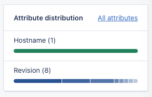
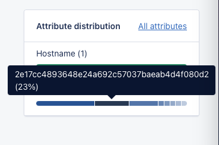

# Welcome to the AppSignal hiring repository!

This repository contains a NextJS app that renders a component we'd like you to finish.

The content of the readme below assumes you've been invited to participate in this exercise. Only when invited, the conditions and compensations apply.


# Conditions and compensation

There's a 4-hour time limit on this exercise; we want you to spend only what is necessary, because your time is valuable, and we only want to take what is needed.

We don't expect you to work for free; there will be compensation in the form of a gift card or the option to donate to an open-source project.


# Preparation

The repository contains a [nextjs](https://nextjs.org) app with [tailwind](https://tailwindcss.com), [jest](https://jestjs.io) and [react-testing](https://testing-library.com/docs/react-testing-library/intro/) already setup.

You can fork this repository to your own (GitHub) account, clone the repository, and install the node packages.

Commands to install the packages, run the app and run the tests are below:

```
npm install # Install the packages
npm run dev # Run a local development copy
npm test --watch # Run tests when files change
```


# Implementation

## Requirements
The screenshot below shows a component lifted from the AppSignal front-end application, which represents a box with distributions for "attributes."



The index page renders a component with a list of `MetadataDistribution` objects passed on to the `MetadataDistributions` component.

Your job is to render a bar for each `MetadataDistributions` object showing the distributions for each value.

* [ ] Render a box with a title and the given `MetadataDistributions`
* [ ] Styled with Tailwind, if applicable.
* [ ] Render each `MetadataDistributions` showing:
	* [ ] The name of the distribution
	* [ ] The number of unique values behind the name
	* [ ] A bar showing the distributions for the first 10 values.
	* [ ] Each bar should have their own color scale
	* [ ] Each bar part can be colored by using Tailwind's color scale (e..g `bg-blue-100` - `bg-blue-900`). Note that Tailwind purges any tags not used. Don't use string interpolation (e.g., `bg-blue-${percentage}`.
	* [ ] Each bar part's width is calculated from the total count and should render its corresponding percentage of the total bar width.
	* [ ] Hovering a bar part shows the name of the part and it's value. We have provided a `Tooltip` component for this.
	* [ ] (optional) There should be a small gap between the bar parts
	* [ ] (optional) Each bar part links to another page (for this exercise linking to `#` is fine)



Additional logic:

The distributions bar should render no more than 10 parts at most. If a distribution contains more than 10 parts, give the top 9 their own bar, and group the remaining count to a bar titled "other", so the total becomes 10 parts.


## Commenting

Feel free to add comments to the code describing your thought process or questions.

## Formatting

Feel free to use the linter settings we've provided. We expect neatly formatted code.

## Testing
Ideally, your components are tested. We use `react-testing` library and expect feature-like tests.

This means rendering the component and evaluating what's been rendered in the DOM (e.g., assert when hovering that the tooltip shows the correct value).

If you have logic in your components, it'd be good to test the logic in unit-like tests (e.g., given these distributions, I expect this outcome).

We've set up a boilerplate test for you to expand on.


## Committing code
We'd like to see small commits with good descriptions of what's happened in the commit. These help us evaluate the code and get a sense of your progress through the exercise.

Submissions with a single "Initial commit" or "did stuff" will not be reviewed.


# Evaluation

The goal of this exercise is to serve as a base from which we can have a discussion about the solutions chosen and the code that has been written.

The goal is **not** to deliver a perfectly completed component within the timeframe.

Ideally, the allotted time is roughly split up as follows:

* ~ 1 hour to implement the styling of the box and the bar(s) using Tailwind where applicable and `style={}` where needed.
* ~ 1.5 hours to implement the logic (bar width, grouping > 10 parts in "other," etc.)
* ~ 1.5 hours to write tests for your components

We'd rather have partial functionality with tests than a fully working component without any tests.

If you are stuck or have any questions, feel free to reach out for help, and good luck!
